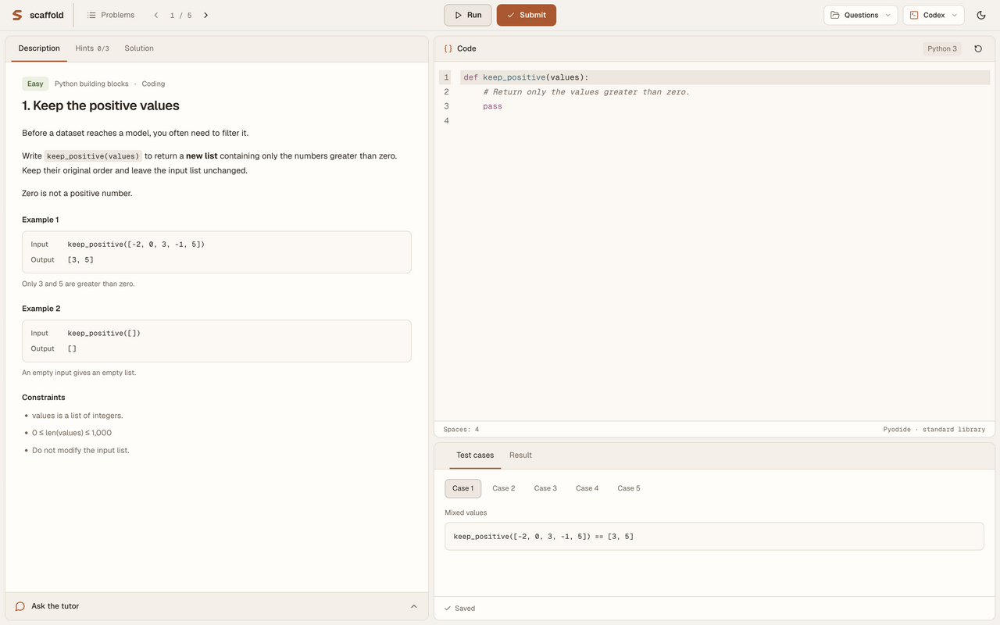

# Scaffold

[Download for Mac](https://github.com/viciousbuilders/scaffold/releases/latest) · [Product page](https://viciousbuilders.com/scaffold)



A personal Mac study app. Create curricula and questions by chatting with Codex in a local folder, then open that folder in Scaffold to practise. Scaffold opens directly into a minimal LeetCode-style split view. It has no curriculum chatbot or question-generation service.

## Install the Mac app

Download the latest DMG, drag **Scaffold.app** into Applications, and open it. The first release supports **Apple silicon Macs with macOS 13 or later**. Install and sign in to your preferred AI CLI separately if you want the optional tutor. No AI provider login is required for local code tests, numeric questions or quizzes.

## Use the local app

Open `dist/Scaffold-darwin-arm64/Scaffold.app` after building it. The app starts its own private loopback process; no web hosting or API key is needed. Choose a locally installed AI CLI from the **AI settings** menu in the top bar for optional tutor chat and conceptual-answer grading. Codex is the default; Claude Code, OpenCode, Pi and custom commands are supported. Sign in through that CLI in Terminal first. Numeric answers, quizzes and code tests are checked locally.

The default workspace is `~/Documents/Scaffold`. The folder button in the top bar chooses another workspace; The empty state offers **Show in Finder**. Open the same folder in Codex and describe your goals. Scaffold creates `AGENTS.md`, `SCAFFOLD.md` and JSON schemas if they are missing, so Codex knows the format. Existing instructions are preserved.

- `curriculum.json`: your learning goal, level, formats and ordered modules.
- `questions.json`: `{ "questions": [...] }`, with stable question IDs.
- `progress.json`: Scaffold-owned answers, feedback, hints, tutor conversations and completion. Codex should leave this file alone.

Scaffold checks the files every three seconds while visible. Invalid edits show an error and keep the last valid questions on screen. Keep question IDs stable when editing to retain matching answers. Progress is saved separately and atomically. Existing browser work is migrated to the default workspace on first use.

## AI providers

Open the provider name in the top bar, choose a CLI, and click **Save & check**. Leave **Model** empty to use that CLI's own default, or enter a model it supports (OpenCode uses `provider/model`). Each provider remembers its own model and executable. **Command settings** accepts an executable name on PATH or an absolute path; common Mac, Homebrew, pnpm and nvm locations are also searched when the app launches from Finder.

| Provider    | Setup in Terminal                           | Request mode                                                                     |
| ----------- | ------------------------------------------- | -------------------------------------------------------------------------------- |
| Codex       | `codex login`                               | `codex exec`, JSON schema, ephemeral session, read-only sandbox                  |
| Claude Code | `claude auth login`                         | Print mode, JSON schema, no saved session, built-in tools and MCP disabled       |
| OpenCode    | `opencode auth login`                       | `opencode run --format json`, dedicated tutor agent with denied tool permissions |
| Pi          | Open `pi`, use `/login`, and choose a model | Print mode, no session, tools, extensions, skills or context files               |
| Custom CLI  | Configure and authenticate your own command | Prompt on stdin, JSON response on stdout                                         |

Checks verify Codex/Claude authentication without making a model request. For OpenCode, Pi and custom commands they confirm the executable is present; authentication and model availability are checked on the first request. Scaffold never silently switches providers after an error.

The adapters follow the official [Codex non-interactive documentation](https://developers.openai.com/codex/noninteractive), [Claude CLI reference](https://code.claude.com/docs/en/cli-reference), [OpenCode CLI documentation](https://opencode.ai/docs/cli/) and [Pi source](https://github.com/earendil-works/pi/tree/main/packages/coding-agent). Use a current CLI release. Requests run in temporary directories, can be cancelled, have a five-minute limit and cap CLI output. OpenCode may keep its own session history; Scaffold does not resume it. The app uses each CLI's existing authentication/configuration and never packages `.env` files. It strips the old app's `OPENAI_API_KEY` and `OPENAI_MODEL` so they cannot override CLI authentication. Configure credentials through your CLI's native login/configuration; Scaffold has no API key field. Inference uses the selected provider's internet connection and account limits.

The tutor receives an allowlisted problem and current attempt, without solutions, answer keys or tests. The same selected provider grades conceptual answers. Numeric answers, quizzes and code tests remain local. Prompting encourages hints but cannot guarantee that a model will never infer an answer.

### Other AI CLIs

Choose **Custom CLI** and enter an executable plus a JSON array of arguments, for example `["--print", "--model", "{model}"]`. Arguments are passed directly without a shell. The command must read the complete prompt from stdin, exit when finished and write a JSON object matching the schema in the prompt to stdout. A single JSON Markdown fence is also accepted. `{model}`, `{schema}` and `{schemaPath}` placeholders are supported in arguments; the schema file exists for the duration of the request. For CLIs with different input/output protocols, point Scaffold at a small executable wrapper that adapts this contract. Configure non-interactive mode and tool restrictions in that command; Scaffold cannot infer flags for an arbitrary CLI. Do not put secrets in arguments.

AI preferences are stored separately in `~/Library/Application Support/Scaffold/ai.json`; changing providers does not touch question files or progress.

Python runs in an isolated Pyodide worker. Its first use downloads the pinned Python runtime. It supports standard-library exercises, not GPU training or arbitrary packages. Runs can be stopped and time out after ten seconds. AI-authored solutions and tests should be checked by Codex before saving them.

## Develop and build

```sh
npm install
# If your npm policy skipped Electron's binary download:
node node_modules/electron/install.js
npm run desktop:dev
```

Build the standalone Mac app:

```sh
npm run desktop:package
```

This creates a local unsigned app in `dist/` for the current Mac architecture. Set `SCAFFOLD_SIGNING_IDENTITY` to your Developer ID Application identity for a signed build. `npm run desktop` builds and launches the desktop shell without packaging. `npm run dev` retains a local browser preview for development.

The current workspace preference lives at `~/Library/Application Support/Scaffold/workspace.json`. Question content and progress live inside your chosen workspace. The settings menu can select a non-standard CLI installation. Optional environment overrides are `SCAFFOLD_CODEX_PATH`, `SCAFFOLD_CLAUDE_PATH`, `SCAFFOLD_OPENCODE_PATH` and `SCAFFOLD_PI_PATH`.

## Structure and checks

`desktop/` owns the window and folder picker. `src/server/workspace.ts` owns filesystem access. `src/core/` defines question and progress formats. `src/features/` contains the workspace view, practice editor and tutor. `src/server/ai/` owns provider adapters, local preferences and subprocess execution.

```sh
npm run typecheck
npm run lint
npm test
npm run build
```

Tests cover grading, question integrity, tutor context, CLI subprocess cancellation and workspace preservation. Tests use fake CLIs and never spend provider usage. The sample solution checks require Python 3.

### Coding languages

Coding questions use a `language` field: `python` (default for existing questions), `javascript`, `cpp`, or `cuda`. Scaffold chooses the editor and runner automatically; there is no language menu that changes the problem's tests.

| Language   | Execution                                                                              |
| ---------- | -------------------------------------------------------------------------------------- |
| Python 3   | Pyodide worker; first run downloads the runtime                                        |
| JavaScript | Fresh browser worker; async functions supported, no Node imports                       |
| C++17      | Local `clang++` or `g++`; install Xcode command line tools on Mac                      |
| CUDA C++   | Editing supported; execution requires `nvcc` and an NVIDIA GPU on a compatible machine |

Cloud GPU execution is a future addition. CUDA Run/Submit stay disabled on this Mac with an explanation. Optional compiler paths: `SCAFFOLD_CPP_COMPILER` and `SCAFFOLD_CUDA_COMPILER`.

Tests are boolean expressions in the question's language. C++ and CUDA answers contain functions and optional includes; Scaffold supplies `main()`. JavaScript tests may use `await`. Native snippets execute as local processes with your user permissions, a 20-second compilation limit, a 10-second execution limit, and capped output. JavaScript also has a 10-second execution limit. Read `LANGUAGES.md` in your question folder when authoring questions with Codex.
